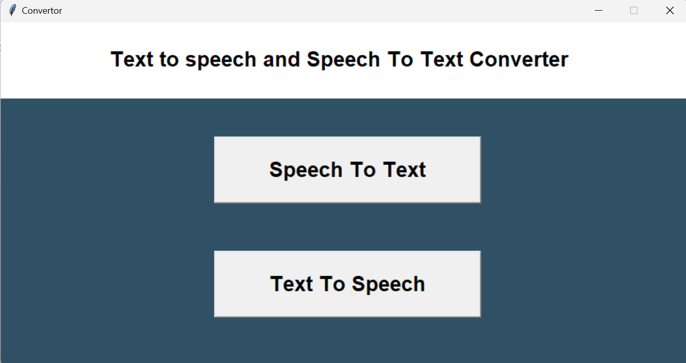
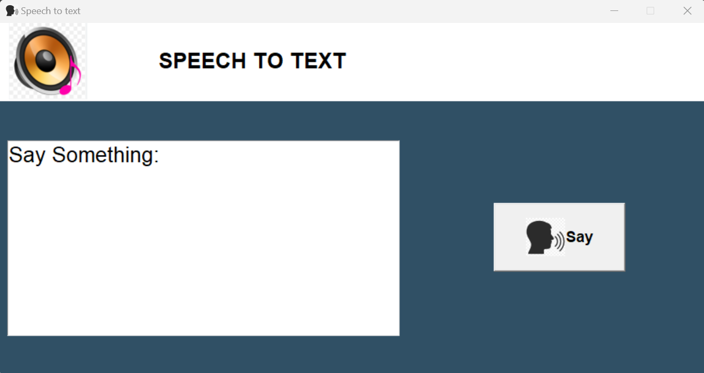
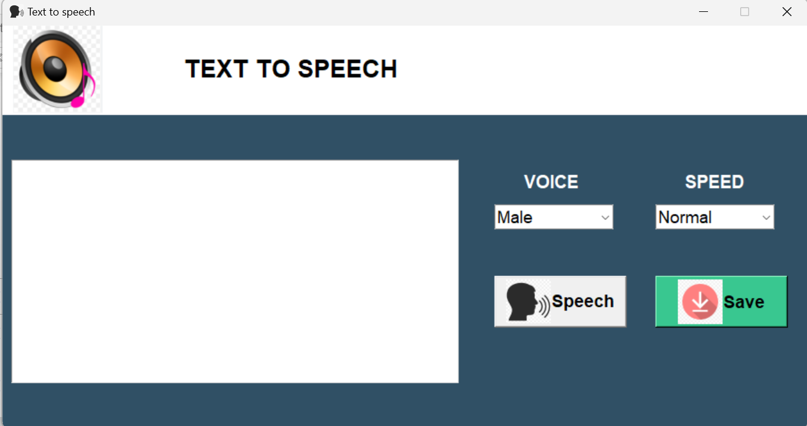

# Text to Speech and Speech to Text Converter

This project provides a simple graphical user interface (GUI) for converting text to speech and speech to text using the `pyttsx3` and `speech_recognition` libraries in Python. 
The application is built with the `tkinter` library for the GUI.

## Features

1. **Speech to Text**:
   - Converts spoken words into text using the Google Speech Recognition API.
   - Displays the recognized text in a text area.

2. **Text to Speech**:
   - Converts written text into speech using the `pyttsx3` library.
   - Allows the user to select the voice (male or female) and speed (fast, normal, slow) for the speech.
   - Provides an option to save the spoken text as an MP3 file.

## Requirements

- Python 3.x
- `tkinter`
- `pyttsx3`
- `speech_recognition`
- `Pillow`

### Speech to Text

1. Click on the "Speech To Text" button.
2. Press the "Say" button and start speaking.
3. The recognized text will appear in the text area.

### Text to Speech

1. Click on the "Text To Speech" button.
2. Enter the text you want to convert to speech in the text area.
3. Select the desired voice (Male/Female) and speed (Fast/Normal/Slow).
4. Click the "Speech" button to hear the text.
5. Click the "Save" button to save the speech as an MP3 file.

## Code Overview

### Main Window

- The main window provides two buttons: "Speech To Text" and "Text To Speech".

### Speech to Text Window

- Uses `speech_recognition` to convert spoken words into text.
- Displays the recognized text in a `Text` widget.

### Text to Speech Window

- Uses `pyttsx3` to convert text into speech.
- Allows selection of voice and speech speed using `Combobox` widgets.
- Provides options to play the speech or save it as an MP3 file.

## Screenshots

### Main Window

### Speech to Text Window

### Text to Speech Window

